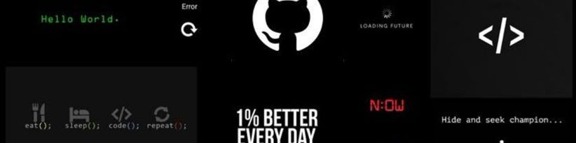

# Hi there, I'm Dolapo! 👋

## About Me 🚀

I’m a passionate Frontend Developer skilled in JavaScript, TypeScript, and modern UI engineering.
I love building elegant user experiences, solving real problems, and shipping clean, efficient code.

- 🌱 Currently learning: Blockchain Development**
- 🔭 Working on: ** **
- 🌍 Languages: **English**
- 📫 How to reach me: **supremeajala@gmail.com**
- ⚡ Fun fact: **I love learning new stuffs**

## My Skills 🧠

## Featured Projects 💻

### [Web3Unilag Website](https://web3unilag.xyz)

**Web3Unilag Website** is a **community platform for blockchain enthusiasts at the University of Lagos** built with **Next.js, TypeScript, and Tailwind CSS**. This project demonstrates my ability to **build responsive UIs, dynamic content systems, and modern Web3-focused websites**. You can check out the repository [[here](https://github.com/Dydex/web3unilag-website)](project_1_repository_link).

### [Project 2 Title](project_2_link)

**[Project 2 Title]** is a **[brief project description]** built with **[technologies used]**. This project showcases my skills in **[skills demonstrated by the project]**. You can check out the repository [here](project_2_repository_link).

## Get in Touch 📬

- **[Personal Website / Blog]**(https://sites.google.com/view/dolapoajala)
- **[LinkedIn]**(https://www.linkedin.com/in/ajala-dolapo-756394281/)
- **[Twitter]**(https://x.com/dp7954)
