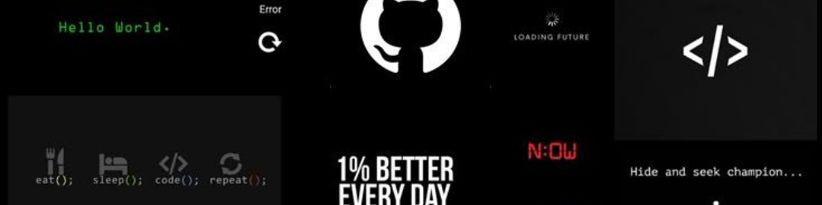

# Hi there, I'm Dolapo! 👋

## Smart Contract Developer | Frontend Developer

I’m a passionate Frontend Developer skilled in JavaScript, TypeScript, and modern UI engineering.
I also build and integrate smart contracts into frontend applications, creating seamless Web3 user experiences.

I love building elegant user interfaces, solving real problems, and shipping clean, efficient code.

🌱 Currently learning: Advanced Blockchain Development & Smart Contract Security

🔭 Working on: Web3 dApps (Frontend + Smart Contract Integration)

📫 Contact: supremeajala@gmail.com.

## My Skills 🧠

## 🌱 Learning & Exploring

* Advanced **Solidity** & Smart Contract Security
* Smart Contract Testing & Deployment with **Foundry**
* Building scalable **Web3 dApps** with Next.js & Solidity
* Deepening knowledge in frontend ↔ blockchain integration

---

## 🤝 Collaboration & Interests

I’m open to collaborating on:

* Frontend Development Projects
* Web3 & Blockchain Development
* Open Source Contributions
* Decentralized Application (dApp) development

---

## Get in Touch 📬

- **[LinkedIn]**(https://www.linkedin.com/in/ajala-dolapo-756394281/)
- **[Twitter]**(https://x.com/dp7954)
